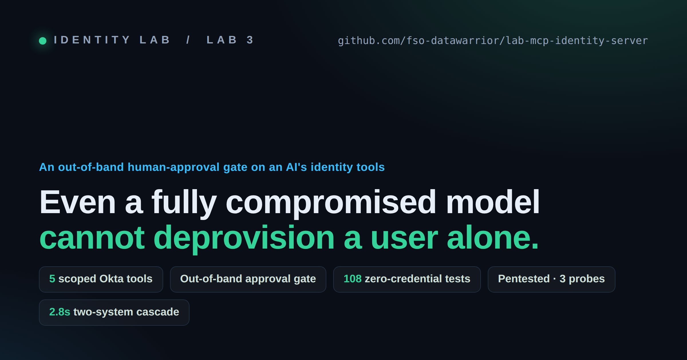
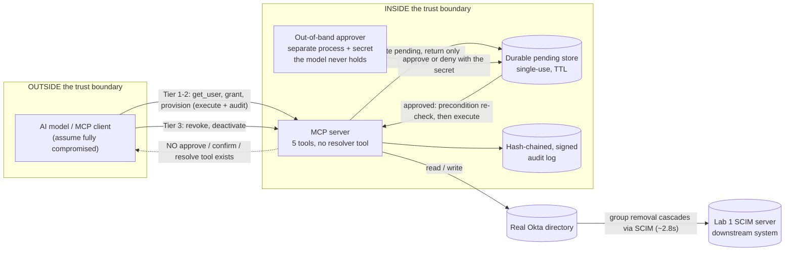
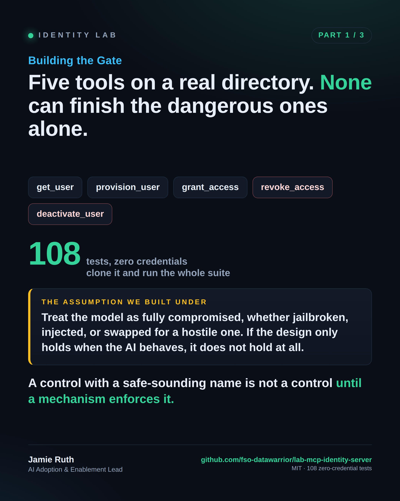
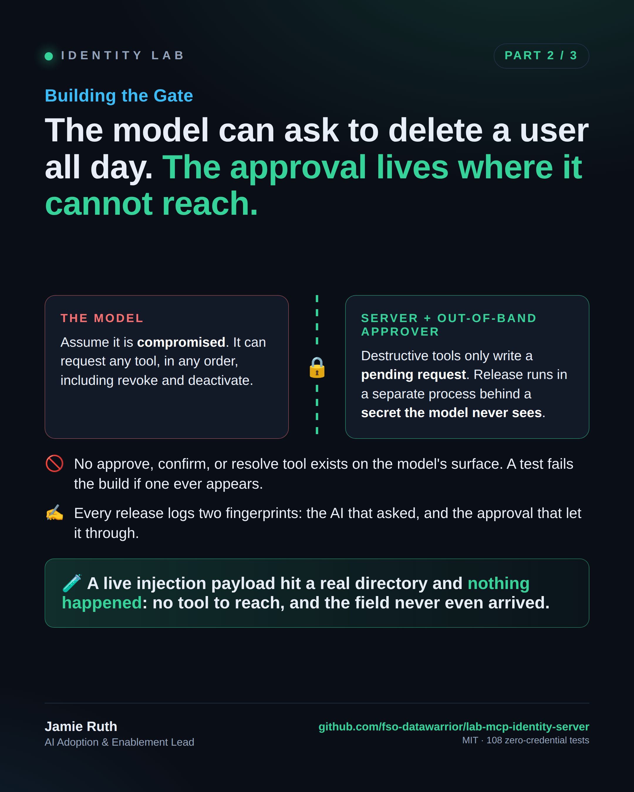
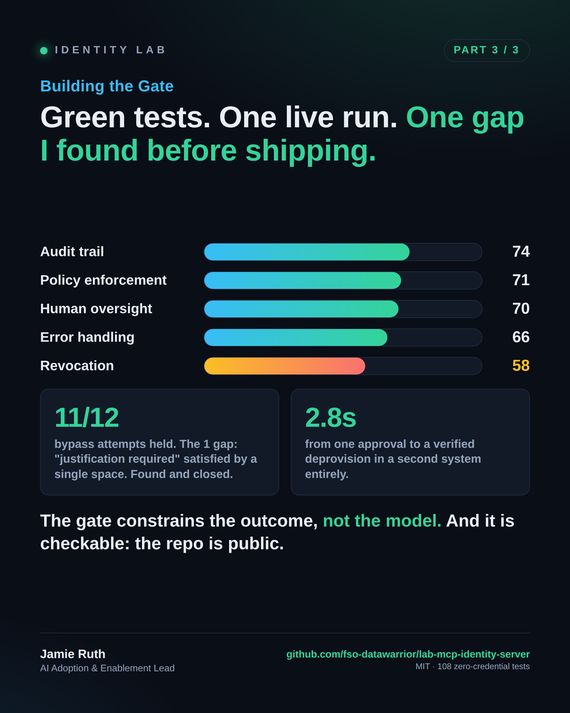

<!--
README.md for fso-datawarrior/lab-mcp-identity-server. No em dashes anywhere.
Assets referenced live in docs/assets/. Paths: ADR records are flat under ADR/;
runbooks are flat under docs/. Preserve any accurate existing badge/link on paste.
-->

<p align="center">
  
</p>

<h1 align="center">lab-mcp-identity-server</h1>

<p align="center">
  <b>An MCP server that gives an AI five scoped Okta identity tools, with the destructive ones behind an out-of-band human approval the model has no channel to reach.</b>
</p>

<p align="center">
  
  
  
  
  
  
</p>

<p align="center">
  <a href="docs/whitepaper/even-a-compromised-model.md"><b>Whitepaper</b></a> &nbsp;·&nbsp;
  <a href="docs/methodology/">Methodology</a> &nbsp;·&nbsp;
  <a href="docs/PENTEST-FINDINGS.md">Pentest findings</a> &nbsp;·&nbsp;
  <a href="#-quickstart-zero-credentials">Quickstart</a> &nbsp;·&nbsp;
  <a href="#-the-identity-lab-series">The series</a>
</p>

---

## 🎯 The 60-second version

- An AI assistant is given **five tools** that operate a **real Okta directory**: look up, create, grant, revoke, deactivate.
- The **destructive** tools (revoke, deactivate) cannot execute in the model's turn. They write a durable pending request and stop. Release happens on a **separate local channel, behind a secret the model never sees**. There is **no approve, confirm, or resolve tool** anywhere on the model's surface, and a test fails the build if one ever appears.
- The design was built to make one bounded claim **true by construction**, then **attacked on purpose** (three adversarial probes) to see whether the claim held.
- The whole **108-test suite runs with zero credentials**, so you can clone it and inspect the exact seam where the destructive branch stops, without an Okta account.

> **The claim.** For the five enumerated identity tools, even a fully compromised model cannot execute a destructive action alone, because the control lives in the server and the out-of-band approval channel and not in the model's behavior. This holds while the server and that channel are uncompromised and the approver cannot be spoofed. The model can still be hijacked, and can still make the call. **The gate constrains the outcome, not the model.**

Read the full write-up: [**Even a Fully Compromised Model Cannot Deprovision a User Alone**](docs/whitepaper/even-a-compromised-model.md) and its [appendices](docs/whitepaper/appendices.md). This repository is a learning artifact, not production software.

---

## 🔍 Why this exists

The failure mode of AI governance is rarely a missing control. It is a control that exists in name and not in mechanism. A "separate" confirm tool the model could still call. An "append-only" log anyone could edit. A "read" that wrote instructions into the model's context. An "additive" grant that escalated a user to admin. Each named a safe idea while its enforcement lived in a convention the constrained thing could reach.

This lab is a documented case study of catching that gap before shipping: an independent blind review before any code, validation against what is actually on disk during the build, one live run against a real directory, and a deliberate adversarial pass, each stage leaving evidence you can re-check. The full story is in the [methodology docs](docs/methodology/) and the [whitepaper](docs/whitepaper/even-a-compromised-model.md).

## 🧱 Architecture: where the control actually lives



The destructive branch of every gated action terminates in the pending store and can only be released by the out-of-band approver, which runs in a separate process behind a secret the model never sees. A test pins the registered tool set to exactly the five operational tools and fails the build if a resolver ever appears. Two independent layers make the claim true: the resolver fails closed by construction, and the model has no tool that reaches it.

## 🛠️ The five tools

| Tool | Kind | Tier | Gated |
|------|------|------|-------|
| `get_user` | read | 1 | no (audited) |
| `provision_user` | additive | 2 | no (audited) |
| `grant_access` | additive | 2 or 3 | Tier 3 when the target group is protected |
| `revoke_access` | destructive | 3 | yes, out-of-band approval |
| `deactivate_user` | destructive | 3 | yes, out-of-band approval |

Tier is a function of the **target**, not the verb: a grant into an ordinary group flows and is audited, a grant into a protected group is gated exactly like a removal, because adding a user to an administrative group escalates privilege as surely as any removal. `delete_user` was cut, because in Okta a delete requires a prior deactivation and is irreversible.

## ⚡ Quickstart (zero credentials)

```bash
git clone https://github.com/fso-datawarrior/lab-mcp-identity-server
cd lab-mcp-identity-server
pnpm install
pnpm test        # 108 tests, all green, no Okta account required
```

The whole suite runs against an in-memory mock directory, so a stranger can clone it, inspect the exact seam where the destructive branch stops, and run every test without any secret. That zero-credential path is a first-class property of the design: a control a stranger cannot inspect and exercise is a control a stranger has no reason to trust.

## 🔌 Running against real Okta (optional)

```bash
cp .env.example .env       # add your Okta org, service-app key, demo group id
pnpm seed:demo             # creates the demo group and users
pnpm smoke:okta            # 5/5 fixture check
pnpm start:real            # or register scripts/start-desktop.mjs in your MCP client
```

The go/no-go checklist ([`docs/MCP-SERVER-CHECKLIST.md`](docs/MCP-SERVER-CHECKLIST.md)) and the recovery runbook ([`docs/BREAK-GLASS.md`](docs/BREAK-GLASS.md)) are the operator surface. `pnpm approve <id>` / `pnpm deny <id>` is the out-of-band channel. Point the real-mode path only at a throwaway developer org with the demo fixture.

## 📊 What we found (the honest part)

This lab scores its own gaps **down**, not up. A five-category agent-governance self-assessment, conservative and carrying no external audit:

| Category | Score | The named gap |
|----------|-------|---------------|
| Audit trail | 74 | deletion-evidence is verify-time, not caller-independent; in-process signing key |
| Policy enforcement | 71 | code-enforced, not a policy engine |
| Human oversight | 70 | single approver, and in the demo a single shared secret, not an authenticated approver |
| Error handling | 66 | fails closed, but the mock is synchronously consistent while a real directory is not |
| **Revocation capability** | **58** | the service credential is scoped organization-wide (Okta scopes are org-wide) |

Three adversarial probes, with honest denominators:

- **Probe A** (gate bypass): 11 of 12 held. The one gap, a blank justification satisfying "justification required," was closed the same session.
- **Probe B** (audit integrity): 7 of 10 held. The deletion-evidence family was closed with a named boundary via [ADR-0003](ADR/0003-audit-log-deletion-evidence.md).
- **Probe C** (live hostile-profile injection): one witnessed run where a poisoned read created nothing.

Full write-up in [`docs/PENTEST-FINDINGS.md`](docs/PENTEST-FINDINGS.md).

One approved revoke removes an Okta group membership and, about **2.8 seconds** later, deprovisions the same user in a second system entirely, through Okta's own provisioning, verified at the far end. One approval, two systems.

## 📖 The methodology (how it was built and checked)

The most transferable thing here is not the server, it is the pipeline that produced it. Three curated records tell that story:

- [**Assumption and Discovery Ledger**](docs/methodology/assumption-ledger.md), every design assumption the build walked in with, the point it broke, and what the design does instead. The reversals are the primary finding.
- [**Build Evidence**](docs/methodology/build-evidence.md), what the code actually proved, milestone by milestone, with the monotonic test spine (7 to 108) and commit hashes.
- [**Prompt Archive**](docs/methodology/prompt-archive.md), how the build was driven, the one-unit-of-work-with-acceptance-criteria loop, and two representative verbatim prompts.

The portable heuristic: **put the control where the constrained thing cannot reach it, then try to break it from the outside.**

## 🗺️ Repository map

| Path | What it is |
|------|-----------|
| [`docs/whitepaper/`](docs/whitepaper) | The whitepaper body and appendices |
| [`docs/methodology/`](docs/methodology) | The ledger, build evidence, and prompt archive |
| [`ADR/`](ADR) | ADR-0001 (out-of-band gate), ADR-0002 (audit fidelity), ADR-0003 (deletion-evidence) |
| [`docs/PENTEST-FINDINGS.md`](docs/PENTEST-FINDINGS.md) | Probes A / B / C, held and gaps |
| [`docs/BREAK-GLASS.md`](docs/BREAK-GLASS.md) | Recovery runbook (kill-switch, restore) |
| [`docs/MCP-SERVER-CHECKLIST.md`](docs/MCP-SERVER-CHECKLIST.md) | Live-demo go/no-go |
| [`src/`](src) | The server, the out-of-band approver, the audit chain, the Okta clients |
| [`test/`](test), [`tests/`](tests) | The 108-case zero-credential suite |

## 🧪 Try to break it

The invitation is the whole point. Clone it, read the [architecture](#-architecture-where-the-control-actually-lives), and try to make a destructive action complete without the out-of-band approval. If you find a way, that is a finding worth more than the demo. The probes we already ran, and the gaps we already found and named, are in [`docs/PENTEST-FINDINGS.md`](docs/PENTEST-FINDINGS.md).

## 🔗 The Identity Lab series

- **Lab 1: [lab-okta-scim-server](https://github.com/fso-datawarrior/lab-okta-scim-server)**, the downstream SCIM target this lab cascades into.
- **Lab 3 (this repo)**, the AI-directed identity operations server with the out-of-band gate.

A LinkedIn series ("Building the Gate," three parts) and a Dev.to series ("Lab 3 Engineering Notes") tell the story for a general engineering audience.

## 🖼️ Visual summary

<p align="center">
  
  &nbsp;
  
  &nbsp;
  
</p>

## ⚖️ License and disclaimer

MIT. This is a demonstration build for learning, not production software. It performs real, destructive identity operations against whatever Okta org you point it at, so run the real-mode path only against a throwaway developer org with the demo fixture. Nothing here should be read as a claim that any system is production-ready, tamper-proof, injection-proof, or secure by default. The one thing it demonstrates is bounded, stated above, and scored openly with its residuals.
